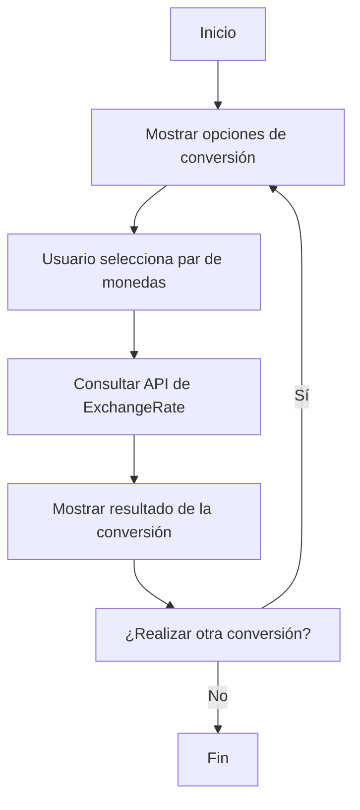
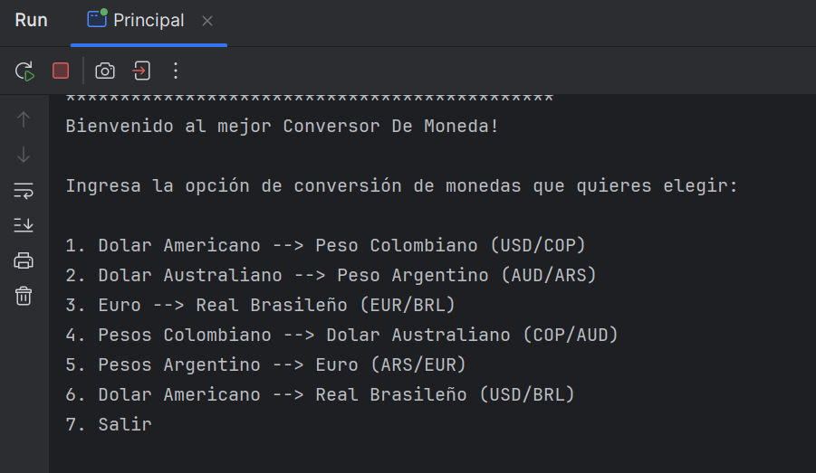
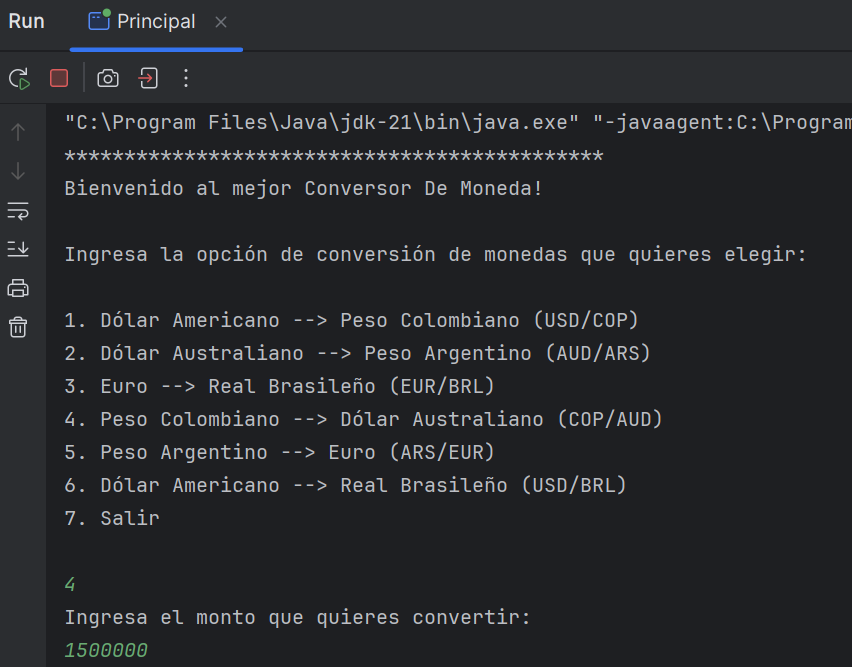
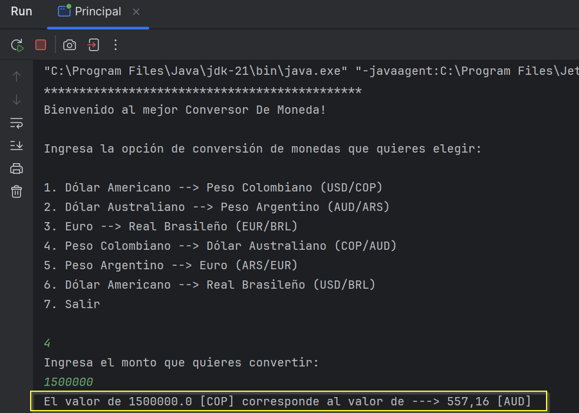

# 💱 Conversor de Monedas

Proyecto desarrollado en Java que permite convertir entre diferentes monedas en tiempo real, utilizando la API de ExchangeRate. Este conversor fue creado como parte del programa Oracle Next Education (ONE) de Alura Latam.

## 🚀 Características

- Conversión de monedas en tiempo real utilizando la API de ExchangeRate.
- Interfaz de línea de comandos amigable para el usuario.
- Manejo seguro de la clave de API mediante un archivo de configuración externo.
- Estructura modular con clases separadas para facilitar el mantenimiento y la escalabilidad.

## 🛠️ Tecnologías Utilizadas

- **Lenguaje de programación:** Java
- **API de tasas de cambio:** [ExchangeRate API](https://www.exchangerate-api.com/)
- **Biblioteca para manejo de JSON:** Gson
- **Control de versiones:** Git & GitHub
- **IDE recomendado:** IntelliJ IDEA

## 📁 Estructura del Proyecto

```text
Conversor-De-Monedas/
├── .idea/                      # Ajustes del proyecto (IDE)
├── assets/                     # Recursos estáticos
│   ├── foto_eliana.jpg         # Imagen de perfil usada en el README
│   ├── ingresodatos.png        # Captura: ingreso de datos
│   ├── inicio.png              # Captura: menú principal
│   └── resultado.png           # Captura: resultado de conversión
├── src/                        # Código fuente
│   ├── ConsultarMonedas.java   # Llama a la API y obtiene los datos
│   ├── ParMonedas.java         # POJO para mapear la respuesta JSON
│   └── Principal.java          # Punto de entrada de la aplicación
├── config-example.properties   # Ejemplo de configuración para la API Key
├── .gitignore                  # Archivos/directorios excluidos de Git
├── Conversor-De-Monedas.iml    # Fichero de proyecto de IntelliJ
└── README.md                   # Documentación (este archivo)
```

## ⚙️ Configuración Inicial

### 1. Clonar el Repositorio

```bash
git clone https://github.com/ElianaMendez/Conversor-De-Monedas.git
cd Conversor-De-Monedas
```

### 2. Obtener una Clave de API

Regístrate en [ExchangeRate API](https://www.exchangerate-api.com/) para obtener una clave de API gratuita.

### 3. Crear el Archivo de Configuración

Crea un archivo llamado `config.properties` en la carpeta `src/` con el siguiente contenido:

```properties
API_KEY=TU_CLAVE_API
```

Reemplaza `TU_CLAVE_API` con la clave que obtuviste en el paso anterior.

### 4. Configurar `.gitignore`

Asegúrate de que el archivo `.gitignore` incluya la siguiente línea para evitar subir tu clave de API al repositorio:

```gitignore
src/config.properties
```

## 🧪 Ejecución del Proyecto

1. Abre el proyecto en tu IDE de preferencia (se recomienda IntelliJ IDEA).
2. Ejecuta la clase `Main.java`.
3. Sigue las instrucciones en la consola para realizar conversiones de moneda.

## 🔄 Flujo del Proyecto



## 📸 Capturas de Pantalla

1. **Menú principal:**
   
2. **Selección de monedas:**
   
3. **Resultado de la conversión:**
   


## 🤝 Contribuciones

Las contribuciones son bienvenidas. Si deseas mejorar este proyecto, por favor:

1. Haz un fork del repositorio.
2. Crea una nueva rama (`git checkout -b feature/nueva-funcionalidad`).
3. Realiza tus cambios y haz commit (`git commit -am 'Agregar nueva funcionalidad'`).
4. Haz push a la rama (`git push origin feature/nueva-funcionalidad`).
5. Abre un Pull Request.

### 👩‍💻 Autor


**Eliana Méndez**  
Desarrolladora Java | QA Engineer | Apasionada por el aprendizaje constante  
[GitHub](https://github.com/ElianaMendez) • [LinkedIn](https://www.linkedin.com/in/tu-usuario)
