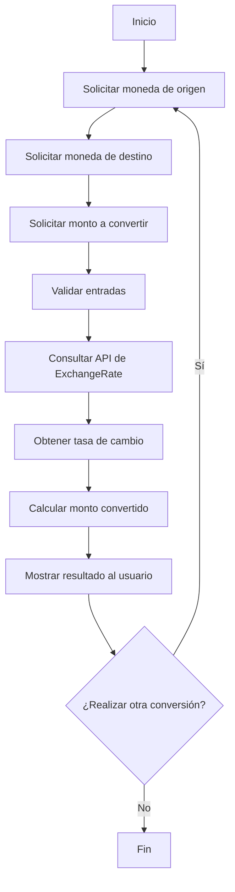

# Conversor de Monedas 💱

Aplicación de consola desarrollada en Java que permite convertir montos entre diferentes monedas utilizando datos en tiempo real proporcionados por la API de ExchangeRate.

## 🚀 Características

- Conversión de monedas en tiempo real.
- Interfaz de línea de comandos intuitiva.
- Integración con la API de ExchangeRate para obtener tasas de cambio actualizadas.
- Manejo de errores y validación de entradas del usuario.

## 📋 Requisitos

- Java Development Kit (JDK) 8 o superior.
- Conexión a Internet para acceder a la API de ExchangeRate.
- Una clave de API válida de ExchangeRate. Puedes obtener una gratuita en [ExchangeRate API](https://www.exchangerate-api.com/).

## 🛠️ Instalación y Ejecución

1. **Clonar el repositorio**

   ```bash
   git clone https://github.com/ElianaMendez/Conversor-De-Monedas.git
   cd Conversor-De-Monedas
   ```

2. **Configurar la clave de API**

   Crea un archivo llamado `.env` en la raíz del proyecto y añade tu clave de API:

   ```env
   API_KEY=TU_CLAVE_DE_API
   ```

3. **Compilar el proyecto**

   ```bash
   javac -d bin src/*.java
   ```

4. **Ejecutar la aplicación**

   ```bash
   java -cp bin ConversorDeMonedas
   ```

## 🔄 Gráfica de Flujo del Proyecto

A continuación, se presenta la gráfica de flujo que describe el funcionamiento del conversor de monedas:



## 📸 Capturas de Pantalla

A continuación, se presentan algunas capturas de pantalla que ilustran el funcionamiento de la aplicación:

1. **Interfaz de inicio**

   

2. **Ingreso de datos**

   

3. **Resultado de la conversión**

   

*Nota: Asegúrate de colocar las imágenes en una carpeta llamada `screenshots` dentro del repositorio.*

## 📄 Licencia

Este proyecto está licenciado bajo la Licencia MIT. Consulta el archivo [LICENSE](./LICENSE) para más detalles.

## 🙋‍♀️ Autor

- **Eliana Méndez** - [GitHub](https://github.com/ElianaMendez)
