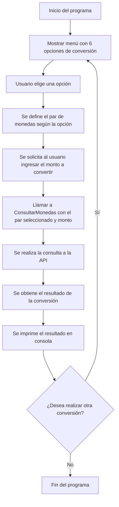

# Conversor de Monedas 💱

Aplicación de consola desarrollada en **Java** que permite convertir montos entre diferentes monedas utilizando datos en tiempo real proporcionados por la **API de ExchangeRate**.

## 🚀 Características

- Conversión de monedas en tiempo real.
- Menú interactivo con 6 combinaciones de monedas predefinidas.
- Consumo de API externa (ExchangeRate).
- Validación de entrada del usuario.
- Opción de realizar múltiples conversiones en una sola ejecución.

## 📋 Requisitos

- Java JDK 8 o superior instalado.
- Acceso a Internet para consumir la API.
- Clave de API gratuita de [ExchangeRate API](https://www.exchangerate-api.com/).

## 🛠️ Instalación y Ejecución

### 1. Clonar el repositorio

```bash
git clone https://github.com/ElianaMendez/Conversor-De-Monedas.git
cd Conversor-De-Monedas
```

### 2. Configurar tu clave de API

Edita la clase `ConsultarMonedas.java` y agrega tu clave API en el string correspondiente:

```java
private static final String API_KEY = "TU_CLAVE_API";
```

### 3. Compilar y ejecutar

```bash
javac -d bin src/*.java
java -cp bin Principal
```

## 🔄 Flujo del Proyecto



## 📸 Capturas de Pantalla

Coloca tus capturas dentro de una carpeta `/screenshots` y haz referencia aquí:

1. **Menú principal**

   

2. **Conversión exitosa**

   

3. **Error de conexión/API**

   

## 📄 Licencia

Este proyecto está bajo la Licencia MIT. Consulta el archivo [LICENSE](./LICENSE) para más detalles.

## 🙋‍♀️ Autora

**Eliana Méndez**  
🔗 [GitHub](https://github.com/ElianaMendez)

---

¡Gracias por visitar el proyecto! 🌍 Si te fue útil, no dudes en darle una ⭐ y contribuir.
